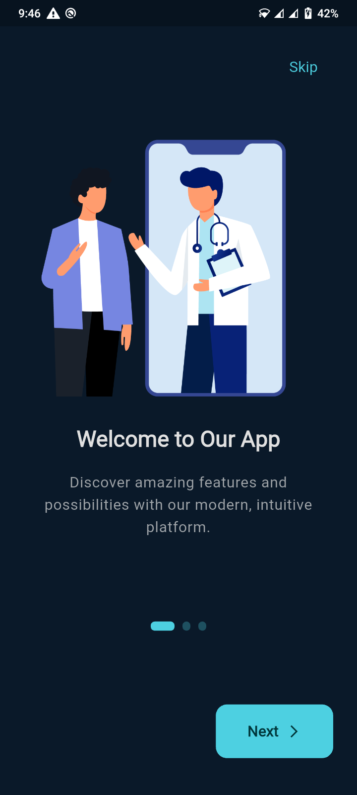
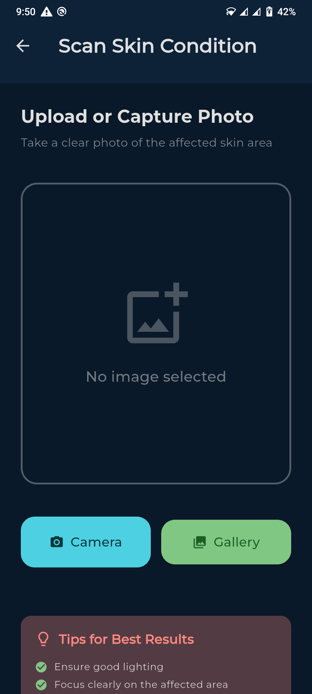
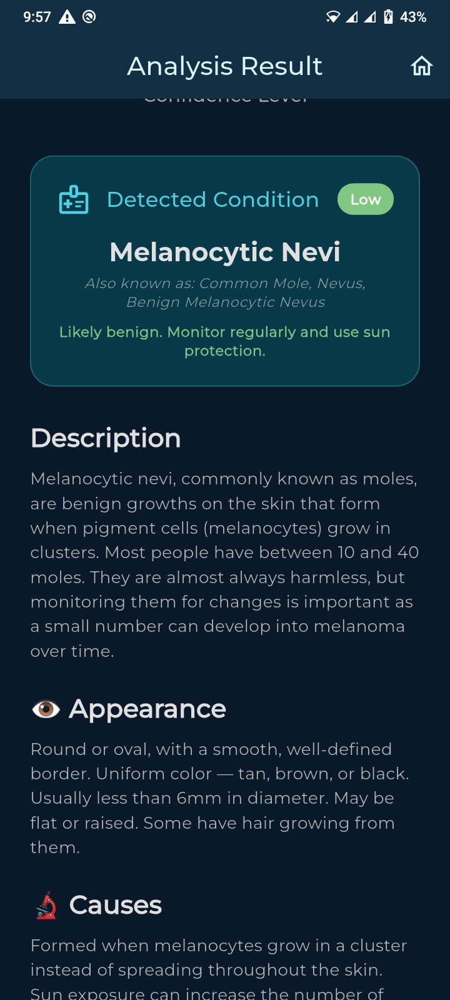

# ClearSkin AI 🩺

**ClearSkin AI** is a cross-platform Flutter application that classifies skin lesions from photos using a CNN trained on the **HAM10000** dataset. It is backed by a **FastAPI** server (with a local **TFLite** fallback on-device), uses **Firebase Auth** for sign-in, and produces detailed, risk-level based reports for each scan.

---

## 📋 Table of Contents

- [Overview](#-overview)
- [Stickers / Icon Pack](#-stickers--icon-pack)
- [Tech Stack](#-tech-stack)
- [Project Structure](#-project-structure)
- [Frontend (Flutter App)](#-frontend-flutter-app)
- [Backend (FastAPI Server)](#-backend-fastapi-server)
- [Screenshots](#-screenshots)
- [Presentation](#-presentation)

---

## 🔎 Overview

ClearSkin AI lets a user snap or upload a photo of a skin lesion and get back:

- A predicted diagnosis across 7 classes (from HAM10000): Actinic Keratoses, Basal Cell Carcinoma, Benign Keratosis, Dermatofibroma, Melanoma, Melanocytic Nevi, and Vascular Lesions
- A **risk level** (Low / Medium / High / Critical) with color-coded feedback
- Guardrails that reject non-skin images and low-confidence/ambiguous predictions
- Practical advice, prevention tips, and "when to see a doctor" guidance
- A shareable **PDF report** of the scan result
- Multi-language support, scan history, and push notifications

---

## 🎨 Stickers / Icon Pack

The [`ClearSkin Stickers`](./ClearSkin%20Stickers) folder contains the custom icon/sticker set used throughout the app's onboarding, scan flow, and result screens (provided as both `.svg` and `.png`).

| | | |
|---|---|---|
|  <br> `01_sun_uv` |  <br> `02_magnifier_scan` |  <br> `03_dermatologist` |
|  <br> `04_sunscreen` |  <br> `05_healthy_check` |  <br> `06_warning_alert` |
|  <br> `07_camera_scan` |  <br> `08_heart_pulse` |  <br> `09_calendar_appointment` |
|  <br> `10_shield_protection` |  <br> `11_ai_brain_analysis` |  <br> `12_water_hydration` |
|  <br> `13_skincare_routine` |  <br> `14_mobile_app_scan` | |

> 14 icons in total, covering sun/UV awareness, scanning, dermatologist visits, sunscreen, hydration, skincare routine, AI analysis, alerts, and app usage.

---

## 🧰 Tech Stack

**Frontend**
- Flutter (Dart) — cross-platform (Android/iOS)
- `flutter_riverpod` for state management
- `go_router` for navigation
- `firebase_auth`, `google_sign_in`, `flutter_facebook_auth` for authentication
- `tflite_flutter` for on-device inference fallback
- `flutter_local_notifications` / `firebase_messaging` for notifications
- `pdf` + `printing` for generating scan reports
- `flutter_localizations` / ARB files for multi-language support (English, German, Spanish, French, Hindi, Indonesian, Portuguese, Russian, Turkish)

**Backend**
- FastAPI (Python)
- TensorFlow / TFLite for model inference
- Pillow + NumPy for image preprocessing
- Uvicorn as the ASGI server

**Model**
- CNN trained on the **HAM10000** dataset, exported to TFLite for both server-side and on-device inference

---

## 🗂 Project Structure

```
end_project/
├── ClearSkin Stickers/     # Icon/sticker asset pack (svg + png)
├── android/                # Android platform project
├── assets/                 # Images, Lottie animations, TFLite model
│   └── models/skin_disease_model.tflite
├── backend/                # FastAPI server
│   ├── api.py
│   ├── requirements.txt
│   └── saved_model/
├── lib/                    # Flutter application source
│   ├── constants/
│   ├── core/                # config, routing, notifications
│   ├── features/            # auth, scan, history, home, onboarding, profile
│   ├── l10n/                 # localization
│   └── shared/               # models, providers, widgets
├── Skin-Disease-Prediction-Mobile-Application.pptx   # Project presentation
└── pubspec.yaml
```

---

## 📱 Frontend (Flutter App)

### Prerequisites
- Flutter SDK (`^3.10.0` per `pubspec.yaml`)
- A configured Firebase project (`google-services.json` for Android already included under `android/app/`)

### Setup

```bash
# Install dependencies
flutter pub get

# Generate localization files (if needed)
flutter gen-l10n

# Run on a connected device/emulator
flutter run
```

Key configuration (API base URL, feature flags, etc.) lives in `lib/core/config.dart`.

---

## ⚙️ Backend (FastAPI Server)

### Prerequisites
- Python 3.10+

### Setup

```bash
cd backend

# Create and activate a virtual environment
python -m venv venv
source venv/bin/activate   # on Windows: venv\Scripts\activate

# Install dependencies
pip install -r requirements.txt

# Run the API server
python api.py
# or
uvicorn api:app --host 0.0.0.0 --port 8000 --reload
```

The server loads the TFLite model from `../assets/models/skin_disease_model.tflite` and exposes prediction endpoints consumed by the Flutter app. A model retraining script (including "healthy" skin samples) is available at `backend/retrain_with_healthy.py`.

---

## 🖼 Screenshots

| Onboarding | Upload | Result |
|---|---|---|
|  |  |  |

Additional screens: `boarding2.png`, `boarding3.png`, `result_prediction.png`.

---

## 🎓 Presentation

The full project presentation is available here:
[`Skin-Disease-Prediction-Mobile-Application.pptx`](./Skin-Disease-Prediction-Mobile-Application.pptx)

---

## ⚠️ Disclaimer

ClearSkin AI is intended for informational purposes only and is **not a substitute for professional medical diagnosis**. Always consult a qualified dermatologist for any skin concerns.
